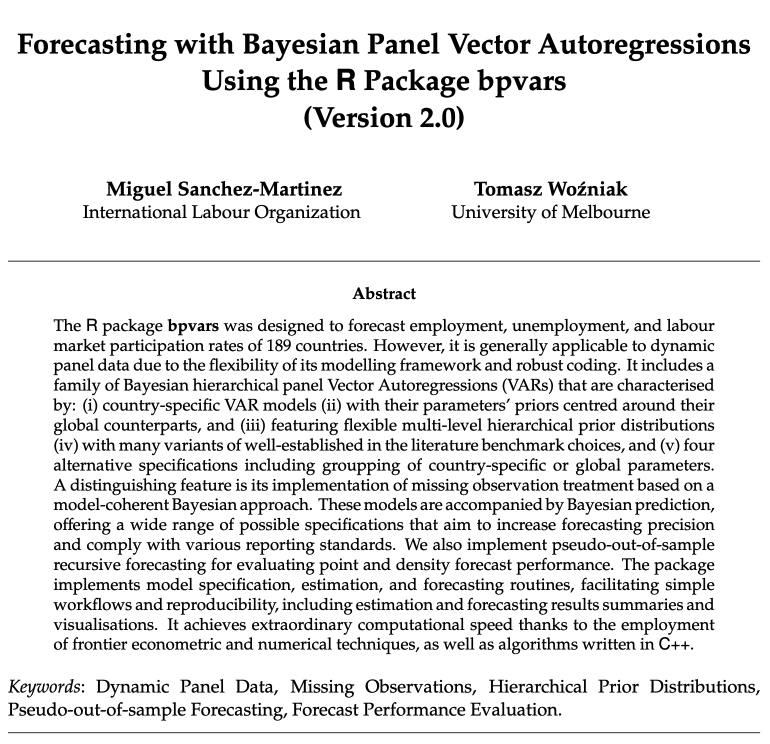
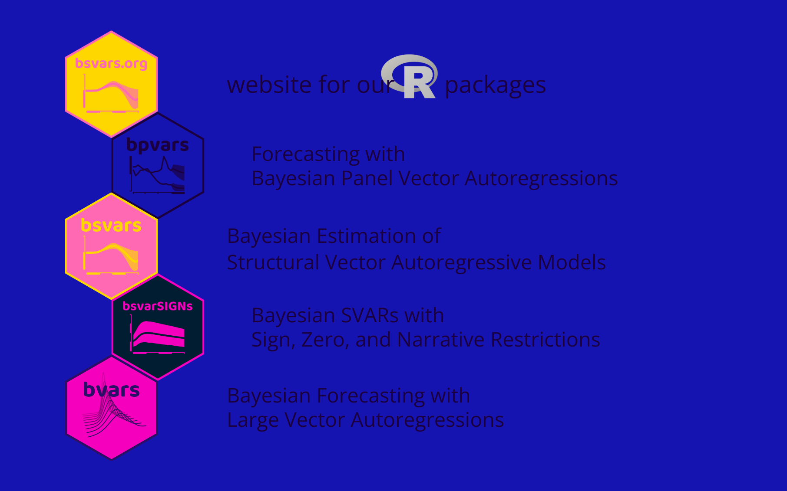

##  {background-color="#1614B1"}

### Forecasting Labour Market Indicators 

### Using the R Package bpvars

$$ $$

$$ $$

$$ $$

$$ $$

$$ $$

$$ $$

### Tomasz Woźniak {style="color:#1A003F;"}

{.absolute top=275 right=75 width="300"}


## Coming up next  {background-color="#1614B1"}

$$ $$

### modelling and forecasting framework {style="color:#1A003F;"}

### the R package [bpvars](https://bsvars.org/bpvars) {style="color:#1A003F;"}

<!-- ### roadmap {style="color:#1A003F;"} -->


## Materials {background-color="#1614B1"} 

$$ $$

### Presentation Slides [as a website](https://bsvars.org/2026-07-Ghana-R/) {style="color:#1A003F;"}

### GitHub [repo](https://github.com/bsvars/2026-07-Ghana-R) to reproduce the slides and results{style="color:#1A003F;"}

### **bpvars** [website](https://bsvars.org/bpvars) and [CRAN](https://cran.r-project.org/package=bpvars) profile {style="color:#1A003F;"}

### [vignette](https://arxiv.org/abs/2606.14143) and [manual](https://cloud.r-project.org/web/packages/bpvars/bpvars.pdf) {style="color:#1A003F;"}

### [bsvars.org](https://bsvars.org/) website {style="color:#1A003F;"}


##  {background-color="#1614B1"} 

{.absolute top=20 right=650 width="400"}
$$ $$

$$ $$

$$ $$

$$ $$

$$ $$

$$ $$

$$ $$

#### This research was funded by the International Labour Organization.

#### The [**bpvars**](https://bsvars.org/bpvars) package, vignette, and other outputs are copyrighted by the [ILO](https://www.ilo.org/). 

#### Thank you!


## modelling and forecasting framework {background-color="#1614B1"}


## modelling and forecasting framework

### data {style="color:#1A003F;"}

- annual country-level time series
- $\begin{bmatrix} gdp_{c.t} & UR_{c.t} & EPR_{c.t} & LFPR_{c.t} \end{bmatrix}$
- sampling period 1991-2024
- 189 countries
<!-- - 34.4% missing observations -->


## modelling and forecasting framework

### data {style="color:#1A003F;"}

```{r}
#| label: data
#| cache: true
#| warning: false
#| message: false
#| echo: false

library(bpvars)

ligh = "#5A58FF"
# ligh = "#2A28C4"
dark = "#1A003F"

C = length(ilo_dynamic_panel)
id_usa = which(names(ilo_dynamic_panel) == "USA")
id_pol = which(names(ilo_dynamic_panel) == "GHA")
time_id = zoo::index(ilo_dynamic_panel[[id_usa]])
var_names = colnames(ilo_dynamic_panel[[id_usa]])

par(
  mfrow = c(2, 2),
  mar = c(0.5, 0.5, 0.5, 0.5),
  oma = c(2, 2, 2, 2)
)
for (n in 1:4) {
  range_i = range(sapply(1:C, \(i)(range(ilo_dynamic_panel[[i]][,n]))))
  plot.ts(
    ilo_dynamic_panel[[id_usa]][,n], 
    ylim = range_i, 
    col = ligh, 
    lwd = 0.2,
    axes = FALSE,
    ylab = "",
    xlab = ""
  )
  for (i in (1:C)[-id_usa]) {lines(ilo_dynamic_panel[[i]][,n], col = ligh, lwd = 0.2)}
  lines(ilo_dynamic_panel[[id_pol]][,n], col = dark, lwd = 2)
  if (n == 1) {
    text(
      time_id[4],
      ilo_dynamic_panel[[id_pol]][34,n],
      "GHA",
      col = dark,
    cex = 2
    )
  }
  text(
    time_id[31],
    range_i[2] - 0.1 * diff(range_i),
    var_names[n],
    col = dark,
    cex = 2
  )
  if (n == 3 || n == 4) {
    axis(
      1,
      labels = c(NA, seq(from = 1995, to = 2020, by = 5), NA),
      at = c(1991, seq(from = 1995, to = 2020, by = 5), 2024),
    )
  }
}
```


## modelling and forecasting framework

### characterisation {style="color:#1A003F;"}

- contemporary Bayesian modelling and institutional
setup
- incorporates best knowledge and practices
- a balance between model size, flexibility, and its
capacity to extract signal from data
- highly computational, application-specific modelling
- inspirations: UN, IPCC, ECB, FED, Christopher Sims


## modelling and forecasting framework

### modelling features {style="color:#1A003F;"}

- Bayesian nonstationary variables handling
- system modelling
- dynamic approach
- <span style="color:#1614B1;">country-specific vector autoregression</span>
- <span style="color:#1614B1;">global vector autoregression for prior mean</span>
- hierarchical modelling
- model-coherent missing observation handling
- parameter grouping
- parameter estimation risk accountability


## modelling and forecasting framework

### country-specific vector autoregression {style="color:#1A003F;"}

\begin{align}
&\\
		\mathbf{y}_{c.t} &= \mathbf{A}_{c.1} \mathbf{y}_{c.t-1} + \mathbf{A}_{d.c}\mathbf{x}_{c.t} + \boldsymbol\epsilon_{c.t}\\[1ex]
		\boldsymbol\epsilon_{c.t}\mid \mathbf{y}_{c.t-1} & \sim N_4\left(\mathbf{0}_4, \boldsymbol\Sigma_c\right)\\[2ex]
\end{align}		
		
- subscript $c$ is for country, and $t$ is for time
- captures country-specific dynamics, uncertainty and heterogeneity
- parameters $\mathbf{A}_{c.1}$, $\mathbf{A}_{d.c}$ and $\boldsymbol\Sigma_c$ are estimated


## modelling and forecasting framework

### global model for the prior mean {style="color:#1A003F;"}

- prior expectations are parameters

\begin{align}
		E_\pi\left[\mathbf{A}_{c}\right] &= \mathbf{A}, \qquad \mathbf{A}_{c} = \begin{bmatrix} \mathbf{A}_{c.1} & \mathbf{A}_{d.c} \end{bmatrix}'\\[1ex]
		E_\pi\left[\boldsymbol\Sigma_c\right] &= \boldsymbol\Sigma\\
\end{align}
		
- parameters $\mathbf{A}_{1}$, $\mathbf{A}_{d}$ and $\boldsymbol\Sigma$ are estimated
- panel data efficiency gains and interpretations

<!-- - a global model under the prior mean -->

<!-- \begin{align} -->
<!-- 		\mathbf{y}_{c.t} &= \mathbf{A}_{1} \mathbf{y}_{c.t-1} + \mathbf{A}_{d}\mathbf{x}_{c.t} + \boldsymbol\epsilon_{c.t}\\[1ex] -->
<!-- 		\boldsymbol\epsilon_{c.t}\mid \mathbf{y}_{c.t-1} & \sim N_4\left(\mathbf{0}_4, \boldsymbol\Sigma\right) -->
<!-- \end{align} -->


## modelling and forecasting framework

### forecasting features {style="color:#1A003F;"}

- original non-stationary variables
- point and density forecasting
- forecasting for models with exogenous variables
- restricted forecasting of rates
- marginal forecasts of labour market indicators
- expanding-window recursive forecasting
- forecast performance evaluation 
- forecast error variance decomposition


## modelling and forecasting framework

### one-period-ahead conditional predictive density {style="color:#1A003F;"}

\begin{align}
&\\
		{\color{lig}p\left(\mathbf{y}_{c.t+1}\mid \mathbf{y}_{c.t},\mathbf{A}_{c},\boldsymbol\Sigma_c\right)} & = N_4\left(\mathbf{A}_{c.1} \mathbf{y}_{c.t} + \mathbf{A}_{d.c}\mathbf{x}_{c.t+1}, \boldsymbol\Sigma_c\right)\\[5ex]
\end{align}
		
- implied by the model
- equivalent to the frequentist predictive density

### predictive density {style="color:#1A003F;"}

\begin{align}
		p\left(\mathbf{y}_{c.t+1}\mid \mathbf{y}_{c.t}\right)
		&= \int p\left(\mathbf{y}_{c.t+1}\mid \mathbf{y}_{c.t},\mathbf{A}_{c},\boldsymbol\Sigma_c\right)p\left(\mathbf{A}_{c},\boldsymbol\Sigma_c\mid \mathbf{y}_{c.t}\right)d\left(\mathbf{A}_{c},\boldsymbol\Sigma_c\right)
\end{align}

- accounts for parameter uncertainty
- used to generate forecast summaries


## the model

### missing observation handling {style="color:#1A003F;"}

- derived model-coherent joint density of missing observations $\mathbf{y}_{c.m}$ given observed data $\mathbf{y}_{c.o}$ and parameters $\mathbf{A}_{c},\boldsymbol\Sigma_c$

\begin{align}
		p\left(\mathbf{y}_{c.m}\mid \mathbf{y}_{c.o},\mathbf{A}_{c},\boldsymbol\Sigma_c\right)
\end{align}

- based on model's likelihood function
- sampled like other parameters during estimation
- parameter estimation and forecasting embed uncertainty about missing observations


## modelling and forecasting framework

### missing data {style="color:#1A003F;"}

```{r}
#| label: missingdata
#| cache: true
#| warning: false
#| message: false
#| echo: false


par(
  mfrow = c(2, 2),
  mar = c(0.5, 0.5, 0.5, 0.5),
  oma = c(2, 2, 2, 2)
)
for (n in 1:4) {
  range_i = range(sapply(1:C, \(i)(range(ilo_dynamic_panel[[i]][,n]))))
  plot.ts(
    ilo_dynamic_panel_missing[[id_usa]][,n],
    ylim = range_i,
    col = ligh,
    lwd = 0.2,
    axes = FALSE,
    ylab = "",
    xlab = ""
  )
  for (i in (1:C)[-id_usa]) {lines(ilo_dynamic_panel_missing[[i]][,n], col = ligh, lwd = 0.2)}
  lines(ilo_dynamic_panel_missing[[id_pol]][,n], col = dark, lwd = 2)
  if (n == 1) {
    text(
      time_id[4],
      ilo_dynamic_panel[[id_pol]][34,n],
      "GHA",
      col = dark,
      cex = 2
    )
  }
  text(
    time_id[31],
    range_i[2] - 0.1 * diff(range_i),
    var_names[n],
    col = dark,
    cex = 2
  )
  if (n == 3 || n == 4) {
    axis(
      1,
      labels = c(NA, seq(from = 1995, to = 2020, by = 5), NA),
      at = c(1991, seq(from = 1995, to = 2020, by = 5), 2024),
    )
  }
}
```


## the R package [bpvars](https://bsvars.org/bpvars) {background-color="#1614B1"}


## the R package [bpvars](https://bsvars.org/bpvars)

### features {style="color:#1A003F;"}

- precise estimation and forecasting
- simple workflows in **R**
- excellent computational speed
  - frontier econometric and numerical techniques
  - algorithms written in **C++**
- extensive documentation
- meeting all CRAN standards
- to install the package run
```r
install.packages("bpvars")
```
- upload it in **R** using
```r
library(bpvars)
```


## the R package [bpvars](https://bsvars.org/bpvars)

{.absolute top=100 right=150 width="800"}


## the R package [bpvars](https://bsvars.org/bpvars)

{.absolute top=100 right=150 width="600"}


## the R package [bpvars](https://github.com/bsvars/bpvars)

### inspect the data {style="color:#1A003F;"}

```{r}
#| label: data_col
#| cache: true
#| warning: false

library(bpvars)                                   # load the package
class(ilo_dynamic_panel)                          # input data is a list
names(ilo_dynamic_panel)[1:72]                    # including multivariate time series for 189 countries
tail(ilo_dynamic_panel$GHA, 8)                    # inspect Ghanian data

```


## the R package [bpvars](https://github.com/bsvars/bpvars)

### specify and estimate the model {style="color:#1A003F;"}

```{r}
#| label: spec
#| cache: true
#| warning: false

spec = specify_bvarPANEL$new(                          # specify the model
  ilo_dynamic_panel,                                   # data
  exogenous = ilo_exogenous_variables                  # exogenous variables
)

burn = estimate(spec, S = 5000, show_progress = FALSE) # run the burn-in
post = estimate(burn, S = 5000)                        # estimate the model

```


## the R package [bpvars](https://github.com/bsvars/bpvars)

### forecast labour market outcomes {style="color:#1A003F;"}

```{r}
#| label: for
#| cache: true
#| warning: false
 
fore = forecast(                                    # forecast the model
  post,                                             # estimation output
  horizon = 3,                                      # forecast horizon
  exogenous_forecast = ilo_exogenous_forecasts,     # forecasts for exogenous variables
) 
plot(fore, "GHA", main = "Forecasts for Ghana")     # plot the forecasts
```


## the R package [bpvars](https://github.com/bsvars/bpvars)

### report the forecasts {style="color:#1A003F;"}

```{r}
#| label: fore_summary
#| cache: true
#| warning: false
 
summ = summary(fore, "GHA")                       # compute forecast summaries
summ$variable2                                    # report forecasts for UR

```


## the R package [bpvars](https://github.com/bsvars/bpvars)

### forecast error variance decomposition {style="color:#1A003F;"}

```{r}
#| label: fevd
#| cache: true
#| warning: false

post |>                                              # estimation output
  compute_variance_decompositions(horizon = 5) |>    # compute variance decompositions
  plot(which_c = "GHA")                              # plot variance decompositions 
```


## the R package [bpvars](https://github.com/bsvars/bpvars)

### specify a model with rates restrictions {style="color:#1A003F;"}

```{r}
#| label: specr
#| cache: true
#| warning: false

specr = specify_bvarPANEL$new(                           # specify the model
  ilo_dynamic_panel,                                     # data
  exogenous = ilo_exogenous_variables,                   # exogenous variables
  type = c("real","rate","rate","rate")                  # set variable type
)

burnr = estimate(specr, S = 5000, show_progress = FALSE) # run the burn-in
postr = estimate(burnr, S = 5000)                        # estimate the model

```


## the R package [bpvars](https://github.com/bsvars/bpvars)

### forecast with restrictions {style="color:#1A003F;"}

```{r}
#| label: forr
#| cache: true
#| warning: false
 
forer = forecast(                                   # forecast the model
  postr,                                            # estimation output
  horizon = 3,                                      # forecast horizon
  exogenous_forecast = ilo_exogenous_forecasts,     # forecasts for exogenous variables
) 
plot(forer, "GHA", main = "Forecasts for Ghana")    # plot the forecasts
```


## the R package [bpvars](https://github.com/bsvars/bpvars)

### specify a model with missing data {style="color:#1A003F;"}

```{r}
#| label: specm
#| cache: true
#| warning: false

specm = specify_bvarPANEL$new(                           # specify the model
  ilo_dynamic_panel_missing                              # data with missing observations
)

burnm = estimate(specm, S = 5000, show_progress = FALSE) # run the burn-in
postm = estimate(burnm, S = 5000)                        # estimate the model

```


## the R package [bpvars](https://github.com/bsvars/bpvars)

### forecast with missing data {style="color:#1A003F;"}

```{r}
#| label: form
#| cache: true
#| warning: false
 
forem = forecast(                                   # forecast the model
  postm,                                            # estimation output
  horizon = 3                                       # forecast horizon
) 
plot(forem, "GHA", main = "Forecasts for Ghana")    # plot the forecasts
```


##  {background-color="#1614B1"}

{.absolute top=80 right=50 width="900"}


##  {background-color="#1614B1"}

{.absolute top=60 right=50 width="900"}


